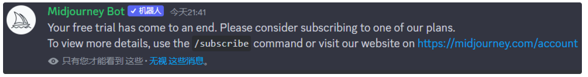
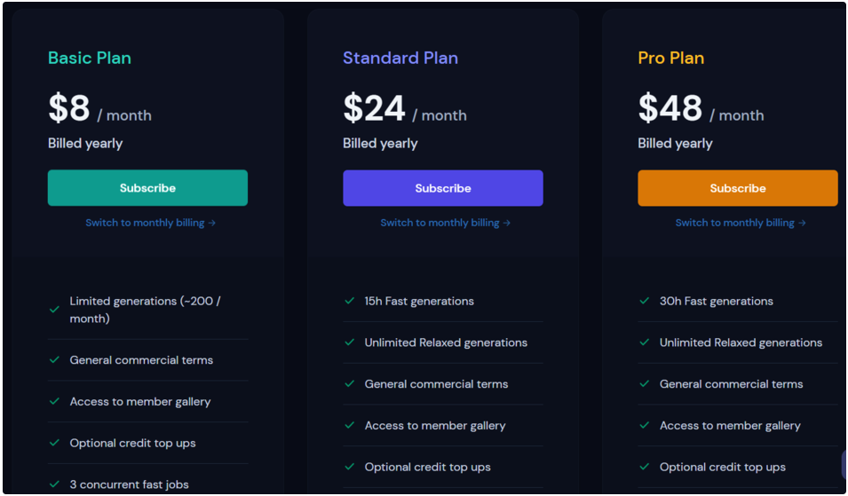
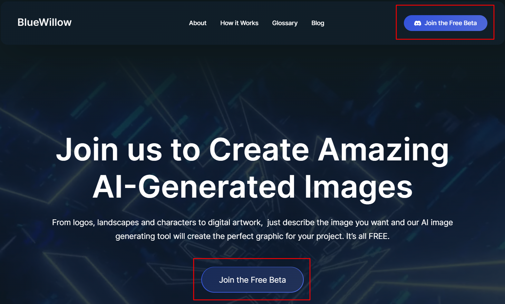
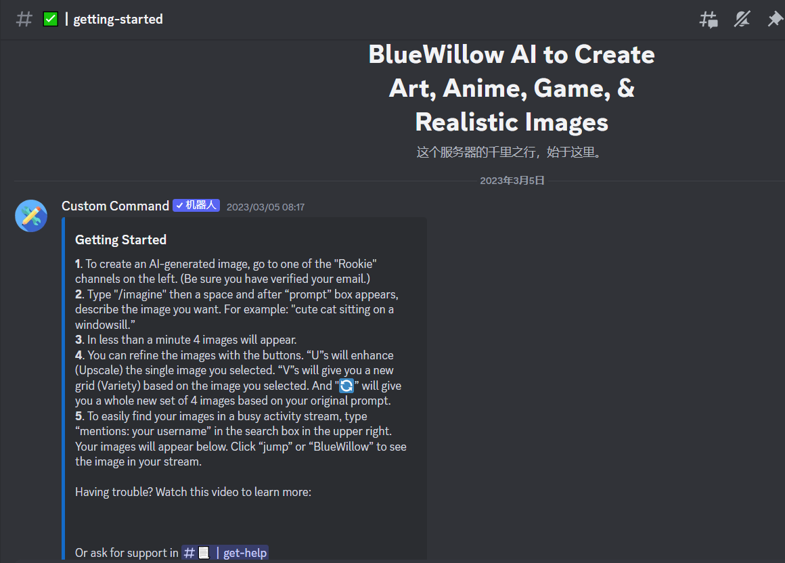
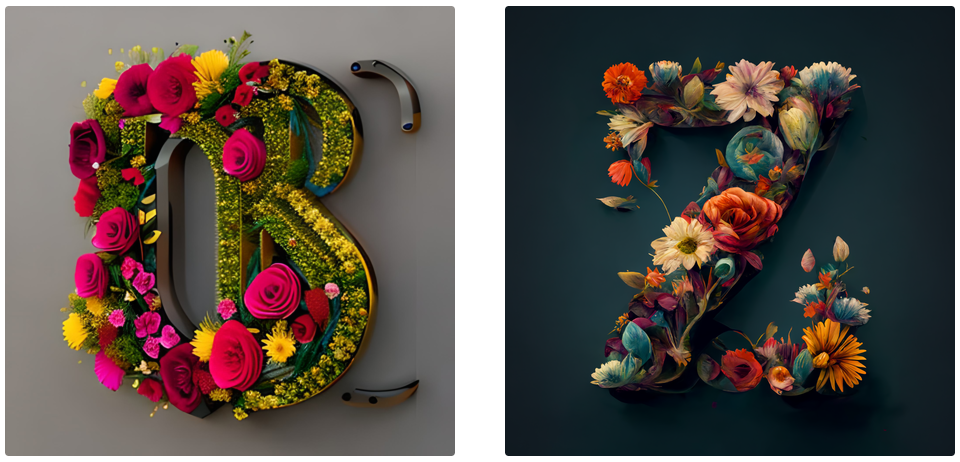

## 1、Midjourney用尽

Midjourney是啥想必不用我多说了吧，最近爆火的AIGC图片生成工具就有其一，特别是最近刚升级的v5版本，让多少设计师直呼要失业了！！！

我也是很早就开始体验Midjourney，中间会断断续续的生成几张图片玩玩，可是就在最近，输入烂熟于胸的`/imagine` 指令时，却返回给我如下消息：



纳尼！！！原来Midjourney和ChatGPT一样，每个账号都是有免费使用额度的，使用完后必须订阅他们的收费服务才能继续使用！！！

好吧，我天真的认为公共频道都是可以无限使用的，看来还是too young too navie。

看了看官网的订阅服务，最基础的包年也要每月$8，而且每月最多生成200张图片。哎，囊中羞涩的我瞬间就断了念想。



可是转念一想：“不对啊，AIGC这么火，我就不相信没有Midjourney的平替，资本家也不是吃素的啊！”。

（ps：Stable Diffusion就算了，电脑性能不行的，出来的图抽象的一匹，别问我是咋知道的(┬┬﹏┬┬)）

于是我就在网上搜寻了一番，别说，还真被我找到了，就是它，[BlueWillow](https://www.bluewillow.ai/)。

## 2、使用BlueWillow

进入BlueWillow的[官网](https://www.bluewillow.ai/#about)，点击下图标注的任意入口进入Discord的BlueWillow频道。



进入频道后，给出的是Getting Started新手教学：



新手教学分为以下几条：

- 在左侧的频道列表中寻找Rookie频道，进入其中一个进行AI图片创作。
- 通过`/imagine`指令并输入提示词开始创建。
- 大概在1min内将出现4张图片。
- 可以点击U和V进行精细化处理和增加变化处理。
- 为快速找到你生成的图片，可以善用右上角的搜索框，输入“mentions: your username”即可快速定位。

可以发现，BlueWillow的整个操作几乎和Midjourney一毛一样，切换没有任何学习成本。什么叫无缝丝滑啊！！！什么叫最佳平替啊！！！

找到后赶紧试了试，下面是BlueWillow（左）和Midjourney（右）在同样的提示词下生成的两张图片，可以看出，Midjourney出图非常完美，而BlueWillow貌似没能完全理解提示词的意思，只能部分复合要求。看来还是得再等BlueWillow一段时间才能达到不错的效果。就怕那个时候已经开始收费了。🤣

```text
logo Z or M written with flowers
```



## 3、总结

从使用BlueWillow的体验来看，有以下几个特点：

- **出图特别快**，真的比Midjourney快多了，指令刚发出去，没过多久就提示我说图片已经生成好了。
- **图片质量还有待提高**，目前也就图一乐，和Midjourney差距还是比较明显。
- 当前**完全免费**，估计知道图片生成能力还不咋地吧，当前使用策略是完全免费的，趁现在大家可以尽情玩耍哈。