# 基于Clion搭建Redis调试环境（Windows系统）

## 目录

-   [1、Cygwin的下载与安装](#1Cygwin的下载与安装)
-   [2、Redis源码下载、编译与运行](#2Redis源码下载编译与运行)
-   [3、Clion环境搭建](#3Clion环境搭建)

我们知道，Redis是基于C语言开发的，因此用到了非常多的C语言函数库。当在Linux下调试Redis源码时，问题较少，因为Linux系统已经预置了Redis使用的函数库。但Windows系统没有预置这些函数库，调试过程就比较麻烦了。

好在早有大佬就解决了这些问题，我们目前可以使用**Cygwin**或者**MinGW**软件安装Redis所需要的函数库，进而搭建源码的Debug环境。本篇文章使用了前者，也就是Cygwin。

## 1、Cygwin的下载与安装

可以在这里 👉 [https://www.cygwin.com/install.html](https://www.cygwin.com/install.html "https://www.cygwin.com/install.html") 下载Cygwin，点击链接下载安装包即可。

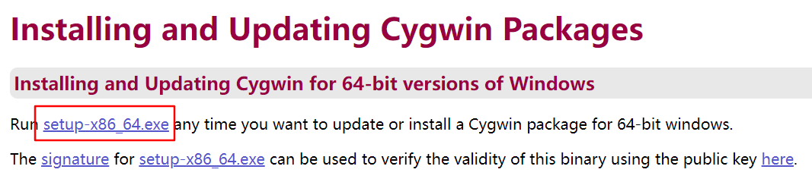

下载完成后，双击 **setup-x86\_64.exe** 软件进行安装。在弹出的选项框依次选择如下选项即可：

-   从互联网安装
-   “根目录”选择合适的目录即可
-   “本地软件包目录”选择合适的目录即可
-   直接连接
-   “选择下载站点”学则阿里云或者网易云都可以，我这边选择的是阿里云

完成以上的选项后，就会出现如下页面，让你选择软件包。

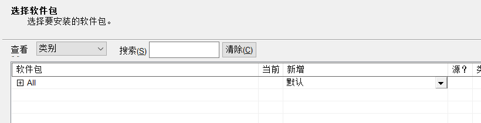

我们需要依次选择**CMake**、**Make**、**gcc-core**、**gcc-g++**、**libgcc1**、**libgccpp1**、**gdb**。

CMake和Make用于构建项目；gcc和g++用于编译C语言和C++语言；libgcc1和libgccpp1是一些运行库；gdb用于调试。

记住，选择的时候，一定要选择 \*\*“新增”**列的**版本号 \*\*，只有选择版本号后才认为需要安装。

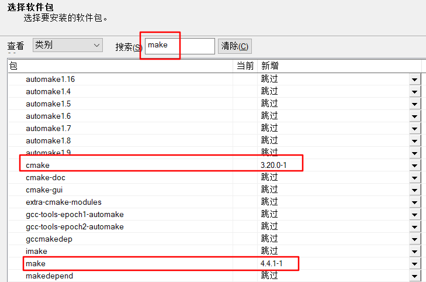

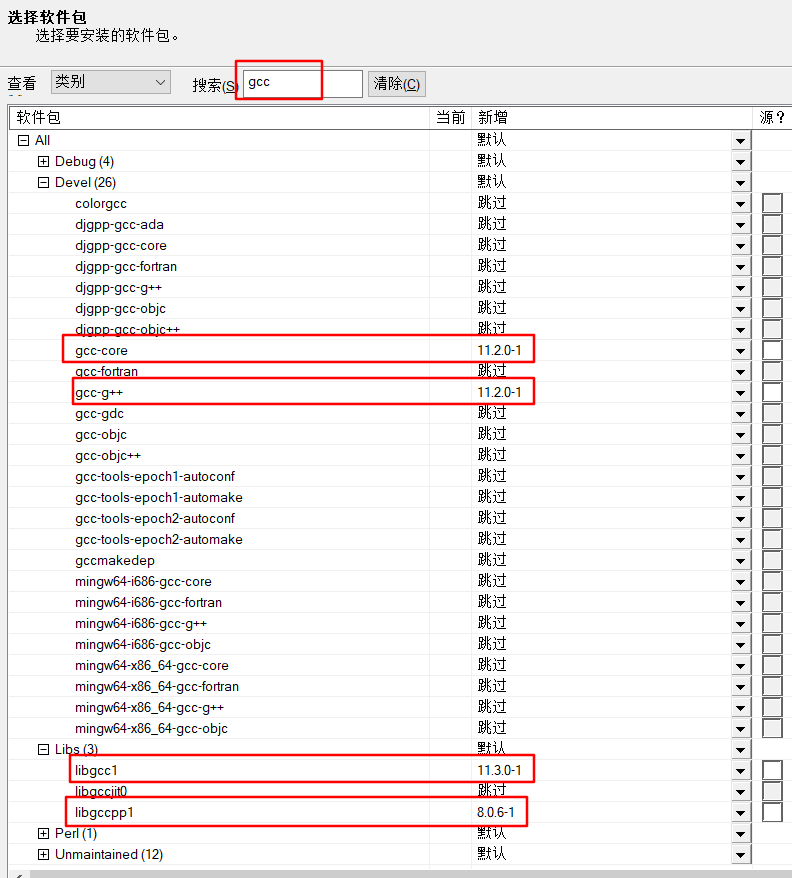

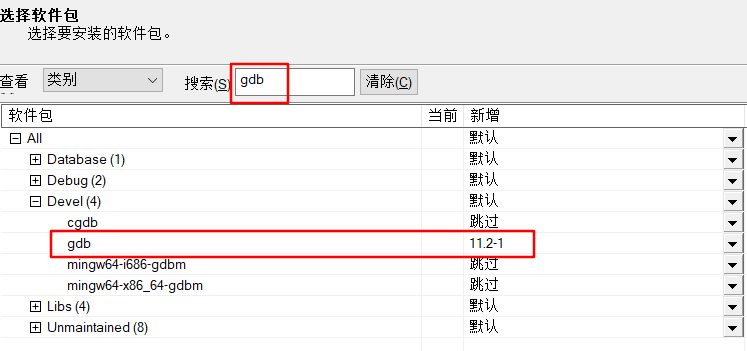

之后就直接下一步直至安装完成了。

下载完成后，双击桌面快捷方式，输入`cygcheck -c cygwin` 命令检查是否安装成功。

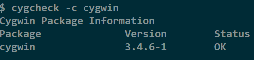

## 2、Redis源码下载、编译与运行

源码可以直接去GitHub上下载即可：

```bash
git clone https://github.com/redis/redis.git
```

完成下载后，我们打开Cygwin的终端，然后定位到Redis的下载目录下，进入根目录后执行下面命令：

```bash
# make 编译
# CFLAGS="-g -O0" 表示编译器不优化编译过程，防止debug时，与源码对应不上
# 使用libc分配内存，否则会报“找不到jemalloc”依赖的问题。具体可以参考https://stackoverflow.com/questions/47088171/error-jemalloc-jemalloc-h-no-such-file-or-directory-when-making-redis
make CFLAGS="-g -O0" MALLOC=libc

```

首次编译的时候可能会报`unknown type name ‘Dl_info’`的错误，这个是类型无法找到的异常。

我们可以不用去深究为啥会报该异常，直接把使用到它的方法（`dumpX86Calls`、`dumpCodeAroundEIP`）注释掉就行了，因为是在debug文件中，应该对运行不会有啥影响。

```c
void dumpX86Calls(void *addr, size_t len) {
    // size_t j;
    // unsigned char *p = addr;
    // Dl_info info;
    // /* Hash table to best-effort avoid printing the same symbol
    //  * multiple times. */
    // unsigned long ht[256] = {0};

    // if (len < 5) return;
    // for (j = 0; j < len-4; j++) {
    //     if (p[j] != 0xE8) continue; /* Not an E8 CALL opcode. */
    //     unsigned long target = (unsigned long)addr+j+5;
    //     target += *((int32_t*)(p+j+1));
    //     if (dladdr((void*)target, &info) != 0 && info.dli_sname != NULL) {
    //         if (ht[target&0xff] != target) {
    //             printf("Function at 0x%lx is %s\n",target,info.dli_sname);
    //             ht[target&0xff] = target;
    //         }
    //         j += 4; /* Skip the 32 bit immediate. */
    //     }
    // }
}

void dumpCodeAroundEIP(void *eip) {
    // Dl_info info;
    // if (dladdr(eip, &info) != 0) {
    //     serverLog(LL_WARNING|LL_RAW,
    //         "\n------ DUMPING CODE AROUND EIP ------\n"
    //         "Symbol: %s (base: %p)\n"
    //         "Module: %s (base %p)\n"
    //         "$ xxd -r -p /tmp/dump.hex /tmp/dump.bin\n"
    //         "$ objdump --adjust-vma=%p -D -b binary -m i386:x86-64 /tmp/dump.bin\n"
    //         "------\n",
    //         info.dli_sname, info.dli_saddr, info.dli_fname, info.dli_fbase,
    //         info.dli_saddr);
    //     size_t len = (long)eip - (long)info.dli_saddr;
    //     unsigned long sz = sysconf(_SC_PAGESIZE);
    //     if (len < 1<<13) { /* we don't have functions over 8k (verified) */
    //         /* Find the address of the next page, which is our "safety"
    //          * limit when dumping. Then try to dump just 128 bytes more
    //          * than EIP if there is room, or stop sooner. */
    //         void *base = (void *)info.dli_saddr;
    //         unsigned long next = ((unsigned long)eip + sz) & ~(sz-1);
    //         unsigned long end = (unsigned long)eip + 128;
    //         if (end > next) end = next;
    //         len = end - (unsigned long)base;
    //         serverLogHexDump(LL_WARNING, "dump of function",
    //             base, len);
    //         dumpX86Calls(base, len);
    //     }
    // }
}
```

随后再次编译，就能看到下面的输出了，表示编译成功。

```text
Hint: It's a good idea to run 'make test' ;)

```

此时，我们能够在src下看到如下可执行文件。

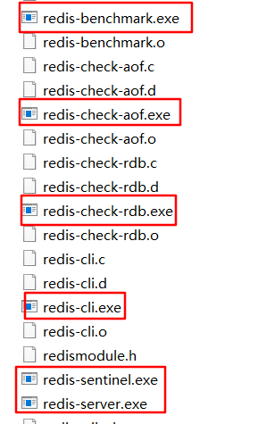

双击`redis-server.exe`试试，会弹出如下错误，这是因为windows下编译的redis需要cygwin1.dll动态链接库，我们直接去Cygwin安装目录的bin目录下拷贝到redis-server.exe的同级目录即可。

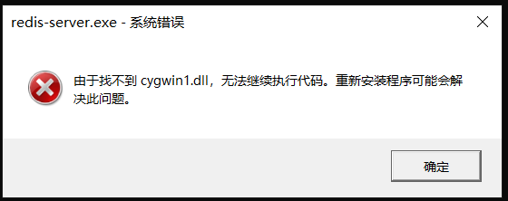

此时再运行便没有任何问题啦。

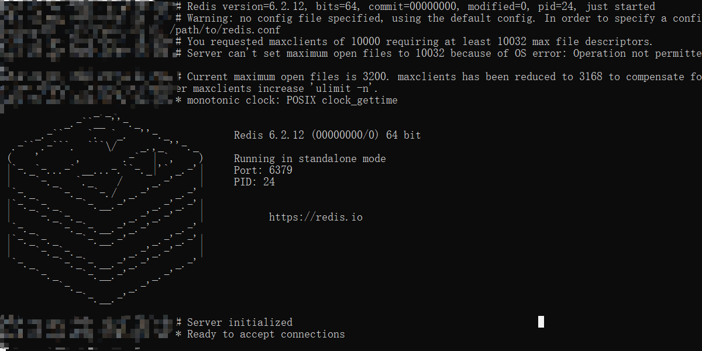

## 3、Clion环境搭建

下载Clion：可以直接去官网 [https://www.jetbrains.com/clion/download/#section=windows](https://www.jetbrains.com/clion/download/#section=windows "https://www.jetbrains.com/clion/download/#section=windows") 下载。

下载好了后，我们用Clion打开Redis工程。首先我们需要配置工具链，在setting→Build, Execution, Deployment→ToolChains处配置。

我们新增一个Cygwin工具链，然后其余的按照下图配置即可。

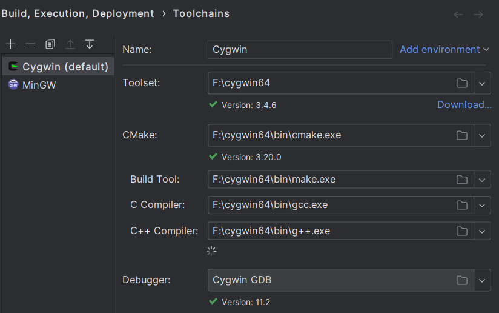

由于Clion都是使用CMake工程，我们需要在项目中率先配置一些CMakeLists.txt文件。

**项目根目录**的CMakeLists.txt：

```makefile
cmake_minimum_required(VERSION 3.0 FATAL_ERROR)
project(redis VERSION 6.0)
#set(CMAKE_INSTALL_PREFIX "${CMAKE_BINARY_DIR}/")
set(CMAKE_RUNTIME_OUTPUT_DIRECTORY ${CMAKE_BINARY_DIR}/../src)
message(CMAKE_RUNTIME_OUTPUT_DIRECTORY is:${CMAKE_RUNTIME_OUTPUT_DIRECTORY})
#if (NOT CMAKE_BUILD_TYPE)
message(STATUS "No build type defined; defaulting to 'Debug'")
set(CMAKE_BUILD_TYPE "Debug" CACHE STRING
        "The type of build. Possible values are: Debug, Release,
RelWithDebInfo and MinSizeRel.")

#endif()
message(STATUS "Host is: ${CMAKE_HOST_SYSTEM}. Build target is:
${CMAKE_SYSTEM}")
get_filename_component(REDIS_ROOT "${CMAKE_CURRENT_SOURCE_DIR}" ABSOLUTE)
message(STATUS "Project root directory is: ${REDIS_ROOT}")
# Just for debugging when handling a new platform.
if (false)
    message("C++ compiler supports these language features:")
    foreach (i ${CMAKE_CXX_COMPILE_FEATURES})
        message(" ${i}")
    endforeach ()
endif ()
message(STATUS "Generating release.h...")
execute_process(
        COMMAND sh -c ./mkreleasehdr.sh
        WORKING_DIRECTORY ${REDIS_ROOT}/src/
)
add_subdirectory(deps)
add_subdirectory(src/modules)
set(SRC_SERVER_TMP
        src/crcspeed.c
        src/crcspeed.h
        src/sha256.c
        src/sha256.h
        src/connection.c
        src/connection.h
        src/acl.c
        src/timeout.c
        src/tracking.c
        src/tls.c
        src/adlist.c
        src/ae.c
        src/anet.c
        # windows屏蔽掉下面两个文件，mac系统不需要屏蔽，这两个是mac环境多路复用的库
        # /usr/local/include/event.h
        # src/ae_kqueue.c
        src/mt19937-64.c
        src/mt19937-64.h
#        src/monotonic.c
#        src/monotonic.h
        src/dict.c
        src/sds.c
        src/zmalloc.c
        src/lzf_c.c
        src/lzf_d.c
        src/pqsort.c
        src/zipmap.c
        src/sha1.c
        src/ziplist.c
        src/release.c
        src/networking.c
        src/util.c
        src/object.c
        src/db.c
        src/replication.c
        src/rdb.c
        src/t_string.c
        src/t_list.c
        src/t_set.c
        src/t_zset.c
        src/evict.c
        src/defrag.c
        src/module.c
        src/quicklist.c
        src/expire.c
        src/childinfo.c
        src/redis-check-aof.c
        src/redis-check-rdb.c
        src/lazyfree.c
        src/geohash.c
        src/rax.c
        src/geohash_helper.c
        src/siphash.c
        src/geo.c
        src/t_hash.c
        src/config.c
        src/aof.c
        src/pubsub.c
        src/multi.c
        src/debug.c
        src/sort.c
        src/intset.c
        src/syncio.c
        src/cluster.c
        src/crc16.c
        src/endianconv.c
        src/slowlog.c
        src/scripting.c
        src/bio.c
        src/rio.c
        src/rand.c
        src/memtest.c
        src/crc64.c
        src/bitops.c
        src/sentinel.c
        src/notify.c
        src/setproctitle.c
        src/blocked.c
        src/hyperloglog.c
        src/latency.c
        src/sparkline.c
        src/t_stream.c
        src/lolwut.c
        src/lolwut.h
        src/lolwut5.c
        src/lolwut6.c
        src/listpack.c
        src/localtime.c
        src/gopher.c
        )
set(SRC_SERVER src/server.c ${SRC_SERVER_TMP})
set(SRC_CLI
        src/anet.c
        src/sds.c
        src/adlist.c
        src/redis-cli.c
        src/zmalloc.c
        src/release.c
        src/ae.c
        src/crc64.c
        src/crc16.c
        src/dict.c
        src/siphash.c
        )
if (${CMAKE_SYSTEM_NAME} MATCHES "Linux")
    # better not to work with jemalloc
endif()
set(EXECUTABLE_OUTPUT_PATH src)
add_executable(redis-server ${SRC_SERVER})
add_executable(redis-cli ${SRC_CLI})
set_property(TARGET redis-server PROPERTY C_STANDARD 99)
set_property(TARGET redis-server PROPERTY CXX_STANDARD 11)
set_property(TARGET redis-server PROPERTY CXX_STANDARD_REQUIRED ON)
set_property(TARGET redis-cli PROPERTY C_STANDARD 99)
set_property(TARGET redis-cli PROPERTY CXX_STANDARD 11)
set_property(TARGET redis-cli PROPERTY CXX_STANDARD_REQUIRED ON)
target_include_directories(redis-server
        PRIVATE ${REDIS_ROOT}/deps/hiredis
        PRIVATE ${REDIS_ROOT}/deps/linenoise
        PRIVATE ${REDIS_ROOT}/deps/lua/src
        )
target_include_directories(redis-cli
        PRIVATE ${REDIS_ROOT}/deps/hiredis
        PRIVATE ${REDIS_ROOT}/deps/linenoise
        PRIVATE ${REDIS_ROOT}/deps/lua/src
        )
target_link_libraries(redis-server
        PRIVATE pthread
        PRIVATE m
        PRIVATE lua
        PRIVATE linenoise
        PRIVATE hiredis
        )
target_link_libraries(redis-cli
        PRIVATE pthread
        PRIVATE m
        PRIVATE linenoise
        PRIVATE hiredis
        )
link_directories(deps/hiredis/ deps/linenoise/ diredeps/lua/src)
install(TARGETS redis-server
        RUNTIME DESTINATION bin
        )
#set(CMAKE_C_FLAGS "${CMAKE_C_FLAGS} -c")

```

**根目录/deps**目录下的CMakeLists.txt：

```makefile
add_subdirectory(hiredis)
add_subdirectory(linenoise)
add_subdirectory(lua)

```

**根目录/deps/lua**目录下的CMakeLists.txt：

```makefile
set(LUA_SRC
        src/lauxlib.c
        src/liolib.c
        src/lopcodes.c
        src/lstate.c
        src/lobject.c
        src/print.c
        src/lmathlib.c
        src/loadlib.c
        src/lvm.c
        src/lfunc.c
        src/lstrlib.c
        src/lua.c
        src/linit.c
        src/lstring.c
        src/lundump.c
        src/luac.c
        src/ltable.c
        src/ldump.c
        src/loslib.c
        src/lgc.c
        src/lzio.c
        src/ldblib.c
        src/strbuf.c
        src/lmem.c
        src/lcode.c
        src/ltablib.c
        src/lua_struct.c
        src/lapi.c
        src/lbaselib.c
        src/lua_cmsgpack.c
        src/ldebug.c
        src/lparser.c
        src/lua_cjson.c
        src/fpconv.c
        src/lua_bit.c
        src/llex.c
        src/ltm.c
        src/ldo.c
        )
add_library(lua STATIC ${LUA_SRC})

```

**根目录/deps/linenoise**目录下的CMakeLists.txt：

```makefile
add_library(linenoise linenoise.c)

```

**根目录/src/modules**目录下的CMakeLists.txt：

```makefile
cmake_minimum_required(VERSION 3.9)
set(CMAKE_BUILD_TYPE "Debug")

add_library(helloworld SHARED helloworld.c)
set_target_properties(helloworld PROPERTIES PREFIX "" SUFFIX ".so")

add_library(hellotype SHARED hellotype.c)
set_target_properties(hellotype PROPERTIES PREFIX "" SUFFIX ".so")

add_library(helloblock SHARED helloblock.c)
set_target_properties(helloblock PROPERTIES PREFIX "" SUFFIX ".so")

#add_library(testmodule SHARED testmodule.c)
#set_target_properties(testmodule PROPERTIES PREFIX "" SUFFIX ".so")

```

添加完以上文件后，我们便可以以CMake工程运行当前项目了。

如果还不行，即没有出现如下两个CMake工程的特征（Reload CMake Project），我们需要退出Clion，然后将项目中的.idea文件加删除，再次打开工程，Clion便会让你选择是否已CMake工程运行当前项目，点击是即可。

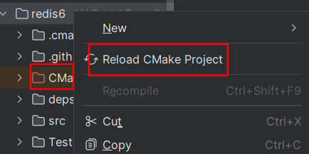

接下来我们便可以愉快的调试Redis的源码啦。

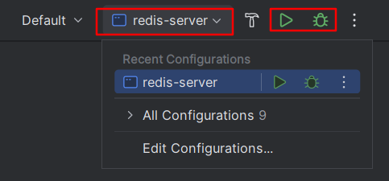

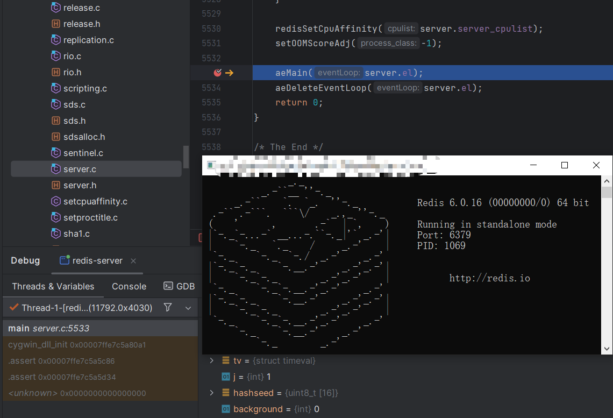
