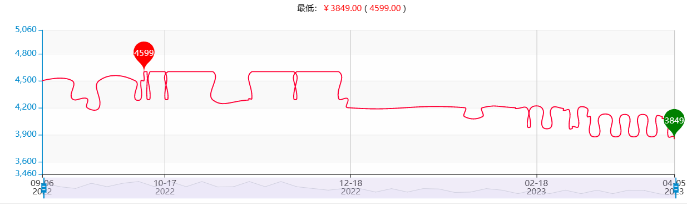
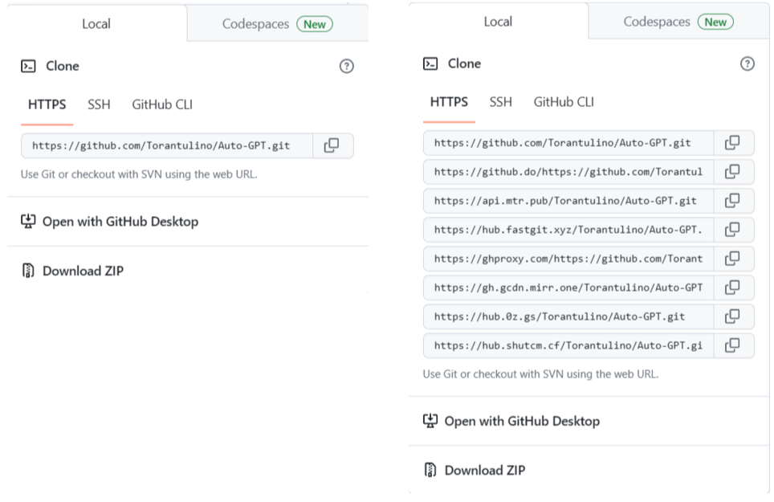
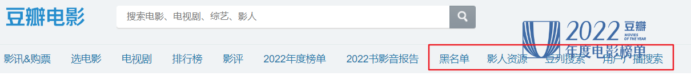
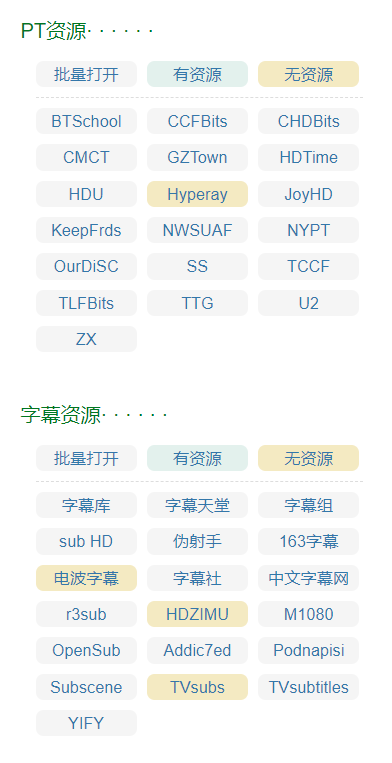
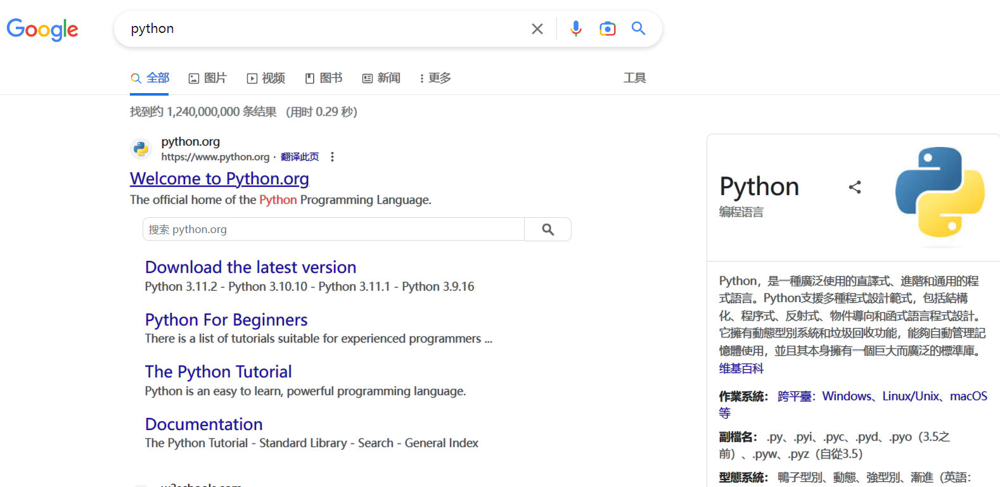

# 推荐6款油猴脚本，总有1款适合你，浏览器也能够用到飞起！！！

> ***本文所列出的所有脚本均可以在 文末 自取，无任何套路。***

## 1、VIP工具箱（多功能脚本）

第1款是多功能脚本，官网地址在 👉 [这里](https://tools.wandhi.com/scripts)。

该脚本号称具备如下功能：

✅ 视频解析    ✅ 音乐下载    ✅ YouTube视频下载

✅ 商品详情页优惠券    ✅ 商品列表页优惠券    ✅ 商品历史价格

✅ B站视频封面获取    ✅ B站视频下载(支持分P下载)    ✅ B站视频一键三连

✅ 百度文库解析    ✅ CSDN页面清洁

✅ 链接自动跳转    ✅ 内容自动展开(❤️❤️❤️待支持的网站等你提交❤️❤️❤️)

✅ 阿里云盘refresh_token获取工具    ✅ 搜索引擎快速跳转

但我实际体验下来，还能用的功能仅剩**知乎外链快速跳转**、**商品历史价格查询**两个功能。或许脚本有段时间不维护了，也有可能是我测试不完全，大家可以自行试试。

**知乎外链跳转**是一个稍微能够提高效率的功能，能够让用户少点击一次确认按钮，对于频繁使用的知乎儿来说应该还是不错的。

**商品历史价格查询**这个功能是真的不错，至少对我来说。能够为自己是否入手某样商品提供不错的参考。下图便是某样商品的历史价格记录，还是挺明显的。

## 2、微信公众号素材资源助手

第2款脚本对微信公众号媒体从业者的帮助可以说十分巨大了。

**当你看到一篇10w+图文，是否想下载其中精美配图？你是否厌倦了一张张图片“右键、另存为、命名”的繁琐步骤？**

有了这个脚本，你便能够**一键下载微信公众号文章资源**，包括图片、视频、音乐，还TM都是无损下载，还不赶紧用起来！！！

## 3、网盘自动提取脚本

第3款脚本是**网盘自动提取**，相信对大家来说都是能用上的。

大家如果经常使用百度网盘或者阿里云盘的话，肯定遇到过来回跳转标签页面对密码复制粘贴的情况！

有了这款油猴脚本，将会帮您自动提取密码，并且自动跳转页面，您连提取按钮都不用点击了，要的就是轻便！

## 4、Github加速

第4款脚本是Github加速下载脚本，简直就是广大不能翻墙的程序员福音啊！

激活该脚本后，我们便能够看到Code下载弹出框**多出了许多下载通道**。下图用最近比较热门的Auto-GPT项目进行了脚本激活前后的下载对比。

有了该脚本，妈妈再也不用担心Github不能下载了！

## 5、豆瓣电影助手

第5个脚本是豆瓣电影助手，轮到电影爱好者啦！

激活该脚本后，你便拥有了**豆列搜索功能**、**电影黑名单功能**（屏蔽你不想看的烂片）、**PT资源搜索链接**（这绝对是最实用的功能了，下载电影）、**字幕搜索**等等，大家可以自行去探索哈。

## 6、字体渲染脚本

第6个脚本是字体渲染脚本，适用于喜欢折腾、美化浏览器人士。

用户无需安装MacType，激活该脚本后，**浏览器便能够自动优化字体显示**，让每个页面的中文字体变得有质感，默认使用微软雅黑字体。

该脚本同样支持自定义设置多种中文字体，附加字体描边、字体重写、字体阴影、字体平滑、对特殊样式元素的过滤等功能。

下图便是默认的字体优化效果。

## 7、总结

以上便是本文推荐的6款油猴脚本啦。也算是覆盖了一些方面。

**大家要是喜欢这些脚本可以关注下面的公众号，回复“油猴脚本”关键字自取哈。无任何套路，回复即可自取。**

**后面我还会推荐更多、更有意思的脚本或者一些提效工具，多多关注不迷路哟！！！**

